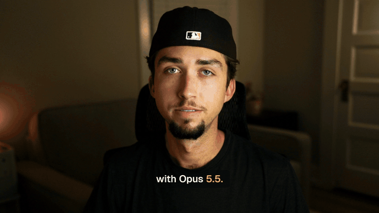

# talking-head-editor

A Claude skill that edits raw talking-head footage into a finished video: tight cuts that never clip a word, studio-clean voice, reframing, word-timed captions, and cinematic motion graphics written as code.



The 30-second demo above was made by running this skill on raw camera footage, retakes and all. Install page: **[griffinwooldridge.com/skills/talking-head-editor](https://griffinwooldridge.com/skills/talking-head-editor)**

## What it does

| Step | What happens |
|---|---|
| Voice | DeepFilterNet removes noise and room echo (capped so it never sounds robotic), then a gentle match-EQ and loudness to -14 LUFS. |
| Transcript | Whisper word timings, transcribed in pause-separated chunks so retakes of the same line are never merged. |
| Cut | You pick the takes. Every pause collapses to ~0.09 s, and every out point waits for the word's real end, including the "-ence" or "-ts" that comes back after a tiny dip. The cut is audited for clipped tails and leftover silence. |
| Framing | Face found automatically. Full shots at 110 %, optional punch-ins, and a split layout (face left, graphic right) under panel graphics. One lanczos pass from the camera original, with an optional LUT. |
| Motion graphics | Each graphic is a small JS file whose `render(t)` is a pure function of time, timed to words with `wt("word")`. Rendered with HyperFrames at 4-8x the frame rate and averaged into real motion blur. |
| Captions | Word-timed cards with the spoken word highlighted, under the face during split shots, hidden during full-frame graphics. |
| Compose | Frame-exact assembly, frame count and decode verified. |

The motion standard the skill holds itself to is in [references/motion.md](references/motion.md): object chains instead of scene cuts, the mechanism shown literally, a camera that moves only on beats, a cursor as the actor, and real footage inside the graphics.

## Install

Requires macOS or Linux, ffmpeg, Node 18+ and Python 3.9-3.12.

```bash
git clone https://github.com/griffinwooldridge/talking-head-editor ~/.claude/skills/talking-head-editor
~/.claude/skills/talking-head-editor/scripts/setup.sh
```

If your default `python3` is 3.13 or newer, point setup at an older one: `PYTHON=/path/to/python3.11 ./scripts/setup.sh`.

## Use

In Claude Code, from a folder with your raw recording:

```
/talking-head-editor edit source.mp4 into a tight 60-second video with motion graphics
```

Claude follows [SKILL.md](SKILL.md): clean the voice, transcribe, choose takes, cut, plan the graphics, reframe, write and critique each graphic, render, caption and compose into `out/final.mp4`. Give notes the way you would to an editor ("tighten the intro", "that graphic is too busy", "rethink the outro") and it edits the scripts and re-renders.

## Layout

```
SKILL.md              the workflow Claude follows
scripts/              voice, transcribe, cut, render_cut, captions, compose, setup
mg/kit/               cine.js + motion-kit.js (seek-safe motion helpers), cine.css (the look)
mg/examples/          three full graphics to learn from
references/           motion standard, cutting rules, restyling for a brand
```

## License

MIT. Fonts (Fraunces, Geist) are under the SIL Open Font License, see `mg/fonts/OFL.txt`. GSAP is downloaded at setup under its own license.
